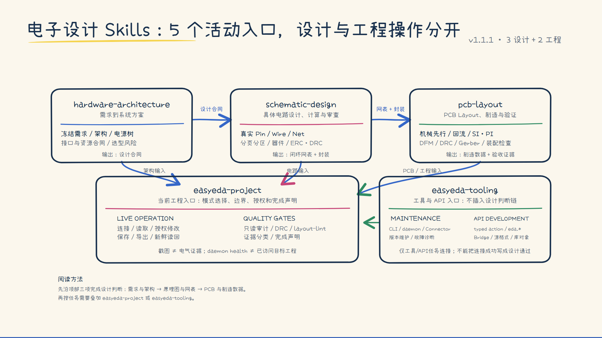
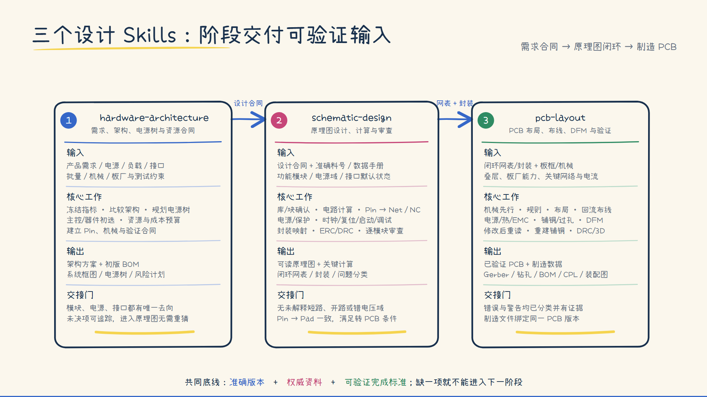

# Electronic Design Skills Toolkit

面向嘉立创EDA（EasyEDA）硬件工作的电子设计 Skills 工具箱，覆盖硬件架构、原理图、PCB、当前工程操作、质量门以及 CLI/daemon/Connector/API 工具能力。

当前版本：**v1.1.1 路由图 / v3.1.0 技能包**

仓库状态：公开

定位：工作流、审查规则与操作参考；不是嘉立创EDA官方产品，也不替代数据手册、板厂规则或实板验证。

## 一眼看懂：v1.1.1 的 5 个活动入口

```text
hardware-architecture → schematic-design → pcb-layout
          │                    │                 │
          └──────────────→ easyeda-project ←─────┘
                                  ▲
                                  │ 当前工程操作 / 质量门

easyeda-tooling：CLI / daemon / Connector / eda.* / Bridge
```

新版路由把设计判断和工程工具分开：前三项沿需求、原理图、PCB 的设计链推进；`easyeda-project` 负责当前工程的连接、读取、授权修改、保存、导出和质量门模式；`easyeda-tooling` 负责 CLI、daemon、Connector、`eda.*` API、Bridge 与源格式开发，不替代设计判断。

[](docs/diagrams/electronic-design-skills-v111.png)

点击图片可查看或下载 1920×1080 原图。图中的箭头表示任务路由和交接关系，不代表仅凭 Skill 输出即可替代数据手册、EDA 原生检查、实板测试或生产验证。

当前仓库中的技能目录仍保留 v3 历史名称，便于兼容和迁移；v1.1.1 的目录迁移应在对应技能内容完成核对后再单独提交。

## 现有技能关系图

### 7 个历史 Skills：三层协作，不是七步串行

七个技能按职责分成设计主线、项目协作层和工具支撑层。日常硬件任务先根据所处阶段选择一个设计 Skill；只有需要操作当前 EasyEDA 工程、建立验收证据或维护工具链时，才叠加相应的协作或支撑 Skill。

### 设计主线：三个阶段连续交付

设计主线由 `hardware-architecture-analysis`、`schematic-design-review` 和 `easyeda-pcb` 组成。它们不是对同一问题重复检查，而是依次把产品需求转化为设计合同、闭环原理图与网表，再转化为经过验证的可制造 PCB 和生产数据。

[](docs/diagrams/easyeda-design-mainline.png)

点击图片可查看或下载 1920×1080 原图。图中的“交接门”表示进入下一阶段前必须关闭的关键问题；它不代表仅凭 Skill 输出即可替代准确数据手册、EDA 原生检查、实板测试或生产验证。

## 技能目录

| Skill | 什么时候使用 | 不负责什么 |
| --- | --- | --- |
| [`hardware-architecture-analysis`](skills/hardware-architecture-analysis/) | 实体硬件需求、系统框图、电源树、接口预算、主控/关键器件初选、成本和风险 | 具体原理图、PCB Layout、纯软件项目 |
| [`schematic-design-review`](skills/schematic-design-review/) | 具体电路计算、器件外围、引脚/网络/NC、原理图设计与审查、转PCB前检查 | 产品总体架构、PCB布线 |
| [`easyeda-pcb`](skills/easyeda-pcb/) | 板框、叠层、布局布线、回流、电源/热、高速、DRC、DFM和制造输出 | 原理图电路判断、客户端连接 |
| [`easyeda-agent`](skills/easyeda-agent/) | 连接并识别当前EasyEDA工程，执行获准的读取、放置、连线、布局、布线、检查、保存和导出 | 安装升级、版本兼容和电路理论 |
| [`easyeda-quality-gates`](skills/easyeda-quality-gates/) | 指定EasyEDA工程的只读学习、审计、DRC结果分类和最终验收 | 连接客户端或直接执行CLI操作 |
| [`easyeda-agent-community-maintenance`](skills/easyeda-agent-community-maintenance/) | 社区CLI/daemon/connector安装升级、版本或动作故障、插件市场差异、块库维护 | 普通工程设计与日常操作 |
| [`easyeda-api-skill`](skills/easyeda-api-skill/) | `eda.*` API查询、扩展开发、源文档格式、库对象与WebSocket Bridge | 常规原理图/PCB工程判断 |

## V3.1.0 更新

- 将 `电子方案分析` 正式重命名为 `hardware-architecture-analysis`，目录名与 Skill 元数据同步使用英文 kebab-case。
- 更新其他设计、操作和质量 Skills 的路由引用，以及安装命令和职责总览。
- 本次只迁移名称，不改变原有硬件架构分析、选型、预算、风险和交接规则。

旧安装目录 `电子方案分析` 不再作为独立 Skill 保留；升级时请改用新目录名。

## V3.0.0 更新

- 新增 `easyeda-agent-community-maintenance`，将安装、升级、连接故障和社区块库维护从项目操作中独立出来。
- 精简 `easyeda-agent`，明确它只承担当前工作区内的实时、可观察操作。
- 更新 `hardware-architecture-analysis`（当时名称为“电子方案分析”）、`schematic-design-review` 和 `easyeda-pcb` 的触发边界，减少纯软件任务、笼统“设计/检查”或跨阶段问题的误触发。
- 更新经典项目、电源拓扑和常见电路参考；历史经验仅用于生成候选，最终结论必须回到准确料号、当前官方资料和实物约束。
- 更新 `easyeda-quality-gates` 的路由关系，使设计判断、工具执行与验收证据相互独立。

详细记录见 [`CHANGELOG.md`](CHANGELOG.md)。

## 推荐使用方式

1. 还没有具体电路时，从 `hardware-architecture-analysis` 开始。
2. 进入具体芯片、外围值和网络连接后，切换到 `schematic-design-review`。
3. 原理图和封装闭环后，使用 `easyeda-pcb`。
4. 需要读写当前嘉立创EDA工程时，再叠加工作区 `easyeda-agent`。
5. 只读学习、完整审计或交付验收时，再叠加 `easyeda-quality-gates`。
6. 只有明确处理安装、升级、连接/版本故障或社区块库时，才使用 `easyeda-agent-community-maintenance`。

技能只规定工作方法，不自动授予修改工程的权限。学习、检查、审查和解释默认只读；修改、保存、批量删除、重新布线或发布外部内容必须有明确授权。

## 安装

按需复制，不必一次安装全部。用户级技能可放入：

```powershell
Copy-Item -Recurse .\skills\hardware-architecture-analysis "$env:USERPROFILE\.codex\skills\hardware-architecture-analysis"
Copy-Item -Recurse .\skills\schematic-design-review "$env:USERPROFILE\.codex\skills\schematic-design-review"
Copy-Item -Recurse .\skills\easyeda-pcb "$env:USERPROFILE\.codex\skills\easyeda-pcb"
Copy-Item -Recurse .\skills\easyeda-quality-gates "$env:USERPROFILE\.codex\skills\easyeda-quality-gates"
Copy-Item -Recurse .\skills\easyeda-agent-community-maintenance "$env:USERPROFILE\.codex\skills\easyeda-agent-community-maintenance"
Copy-Item -Recurse .\skills\easyeda-api-skill "$env:USERPROFILE\.codex\skills\easyeda-api-skill"
```

实时操作技能建议放在具体EasyEDA工作区内，让项目边界更清楚：

```powershell
Copy-Item -Recurse .\skills\easyeda-agent "<你的EasyEDA工作区>\.codex\skills\easyeda-agent"
```

`easyeda-agent` 依赖社区CLI、daemon和Connector，仓库内不捆绑这些可执行组件。`easyeda-api-skill` 的Bridge依赖也不随仓库提交；如确实进行扩展开发，再按该技能说明安装依赖。

## 验证原则

- 操作前确认准确工程、文档、页面和类型；连接健康不等于已经访问目标工程。
- 修改前先读取元件、引脚、网络、层、板框和规则，优先使用typed action。
- 跨原理图和PCB的任务先关闭原理图门，再进入PCB门。
- 结论按“权威设计数据 → 原生DRC/check/layout-lint → 正确视角的视觉证据”建立。
- 静态检查、DRC和截图不能替代实际制板、焊接、上电、测量与环境测试。

## 记忆与文档

| 路径 | 内容 |
| --- | --- |
| [`memory/easyeda-connection-workflow.md`](memory/easyeda-connection-workflow.md) | daemon、客户端、Connector、重连和成功判定经验 |
| [`memory/easyeda-skill-routing.md`](memory/easyeda-skill-routing.md) | V3技能职责与组合方式 |
| [`memory/easyeda-read-only-learning.md`](memory/easyeda-read-only-learning.md) | 只读学习、审查边界和证据结构 |
| [`docs/verified-connection.md`](docs/verified-connection.md) | 一次已验证连接快照；版本和状态可能随时间变化 |

## 来源与许可

- `easyeda-agent` 及其社区维护资料基于 [`zhoushoujianwork/easyeda-agent`](https://github.com/zhoushoujianwork/easyeda-agent) 的工作流与参考内容。
- `easyeda-api-skill` 的元数据标注 MIT、作者为 JLCEDA；仓库保留其来源信息。
- 本仓库不对全部第三方内容统一重新授权；复用或再分发时应分别检查来源文件中的许可和上游条款。
- 连接记忆与验证快照只描述特定环境下的经验，使用前应重新验证当前版本、端口、能力和目标工程。
